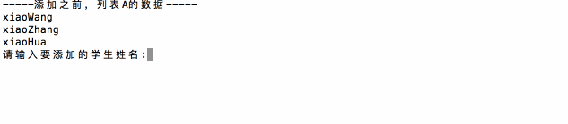

# 
11 列表

## 11.1 列表介绍

- 列表的格式
    ~~~py
    namesList = ['xiaoWang','xiaoZhang','xiaoHua']
    ~~~
- 比C语言的数组强大的地方在于列表中的元素可以是不同类型的
    ~~~py
    testList = [1, 'a']
    ~~~

- 打印列表
    ~~~py
    namesList = ['xiaoWang','xiaoZhang','xiaoHua']
    print(namesList[0])
    print(namesList[1])
    print(namesList[2])
    ~~~

## 11.2 列表操作

### 11.2.1 增

- append：通过append可以向列表添加元素
    ~~~py
    #定义变量A，默认有3个元素
    A = ['xiaoWang','xiaoZhang','xiaoHua']

    print("-----添加之前，列表A的数据-----")
    for tempName in A:
        print(tempName)

    #提示、并添加元素
    temp = input('请输入要添加的学生姓名:')
    A.append(temp)

    print("-----添加之后，列表A的数据-----")
    for tempName in A:
        print(tempName)
    ~~~

      

    - 列表追加数据的时候，直接在原列表里面追加了指定数据，即修改了原列表，故列表为可变类型数据
    - 如果append()追加的数据是一个序列，则追加整个序列到列表
    ~~~py
    name_list = ['Tom', 'Lily', 'Rose']
    name_list.append(['xiaoming', 'xiaohong'])

    print(name_list) # 结果：['Tom', 'Lily', 'Rose', ['xiaoming', 'xiaohong']]
    ~~~

- extend：通过extend可以将另一个集合中的元素逐一添加到列表中
    ~~~py
    a = [1, 2]
    b = [3, 4]
    a.append(b) # [1, 2, [3, 4]]
    a.extend(b) # [1, 2, [3, 4], 3, 4]
    ~~~

- insert：insert(index, object) 在指定位置index前插入元素object
    ~~~py
    a = [0, 1, 2]
    a.insert(1, 3) # [0, 3, 1, 2]
    ~~~

### 11.2.2 删

- del：根据下标进行删除
    ~~~py
    movieName = ['加勒比海盗','骇客帝国','第一滴血','指环王','霍比特人','速度与激情']

    print('------删除之前------')
    for tempName in movieName:
        print(tempName)

    del movieName[2] #删除指定数据
    # del movieName  #删除列表
    print('------删除之后------')
    for tempName in movieName:
        print(tempName)
    ~~~
    ~~~py
    ------删除之前------
    加勒比海盗
    骇客帝国
    第一滴血
    指环王
    霍比特人
    速度与激情
    ------删除之后------
    加勒比海盗
    骇客帝国
    指环王
    霍比特人
    速度与激情
    ~~~

- pop：删除最后一个元素
    ~~~py
    movieName = ['加勒比海盗','骇客帝国','第一滴血','指环王','霍比特人','速度与激情']

    print('------删除之前------')
    for tempName in movieName:
        print(tempName)

    movieName.pop()

    print('------删除之后------')
    for tempName in movieName:
        print(tempName)
    ~~~
    ~~~py
    ------删除之前------
    加勒比海盗
    骇客帝国
    第一滴血
    指环王
    霍比特人
    速度与激情
    ------删除之后------
    加勒比海盗
    骇客帝国
    第一滴血
    指环王
    霍比特人
    ~~~

- remove：根据元素的值进行删除
    ~~~py
    movieName = ['加勒比海盗','骇客帝国','第一滴血','指环王','霍比特人','速度与激情']

    print('------删除之前------')
    for tempName in movieName:
        print(tempName)

    movieName.remove('指环王')

    print('------删除之后------')
    for tempName in movieName:
        print(tempName)
    ~~~
    ~~~py
    ------删除之前------
    加勒比海盗
    骇客帝国
    第一滴血
    指环王
    霍比特人
    速度与激情
    ------删除之后------
    加勒比海盗
    骇客帝国
    第一滴血
    霍比特人
    速度与激情
    ~~~

### 11.2.3 改

  ~~~py
  #定义变量A，默认有3个元素
  A = ['xiaoWang','xiaoZhang','xiaoHua']

  print("-----修改之前，列表A的数据-----")
  for tempName in A:
      print(tempName)

  #修改元素
  A[1] = 'xiaoLu'

  print("-----修改之后，列表A的数据-----")
  for tempName in A:
      print(tempName)
  ~~~py
  -----修改之前，列表A的数据-----
  xiaoWang
  xiaoZhang
  xiaoHua
  -----修改之后，列表A的数据-----
  xiaoWang
  xiaoLu
  xiaoHua
  ~~~

### 11.2.4 查

- python中查找的常用方法为：① in（存在）,如果存在那么结果为true，否则为false； ② not in（不存在），如果不存在那么结果为true，否则false
    ~~~py
    #待查找的列表
    nameList = ['xiaoWang','xiaoZhang','xiaoHua']

    #获取用户要查找的名字
    findName = input('请输入要查找的姓名:')

    #查找是否存在
    if findName in nameList:
        print('在字典中找到了相同的名字')
    else:
        print('没有找到')
    ~~~

      

      

  - in的方法只要会用了，那么not in也是同样的用法，只不过not in判断的是不存在

- index：返回指定数据所在位置的下标
    ~~~py
    a = ['a', 'b', 'c', 'a', 'b']

    a.index('a', 1, 3) # 注意是左闭右开区间
    Traceback (most recent call last):File "<stdin>", line 1, in <module> ValueError: 'a' is not in list

    a.index('a', 1, 4) # 3
    
    a.count('b') # 2
    
    a.count('d') # 0
    ~~~

- len()：访问列表长度，即列表中数据的个数
    ~~~py
    name_list = ['Tom', 'Lily', 'Rose']

    print(len(name_list))  # 3
    ~~~

### 11.2.5 排序

- sort, reverse
  - sort方法是将list按特定顺序重新排列，默认为由小到大，参数reverse=True可改为倒序，由大到小
  - reverse方法是将list逆置

~~~py
a = [1, 4, 2, 3]

a.reverse() # [3, 2, 4, 1]

a.sort() # [1, 2, 3, 4]

a.sort(reverse=True) # [4, 3, 2, 1]
~~~

### 11.2.6 复制

- copy
    ~~~py
    movieName = ['加勒比海盗','骇客帝国','第一滴血','指环王','霍比特人','速度与激情']
    movieName2 = movieName.copy()
    print(movieName2)
    ~~~

## 11.3 列表循环遍历

- for 循环
    ~~~py
    namesList = ['xiaoWang','xiaoZhang','xiaoHua']
    for name in namesList:
        print(name)
    ~~~
    ~~~py
    xiaoWang
    xiaoZhang
    xiaoHua
    ~~~

- while 循环
    ~~~py
    namesList = ['xiaoWang','xiaoZhang','xiaoHua']

    length = len(namesList)

    i = 0

    while i<length:
        print(namesList[i])
        i+=1
    ~~~
    ~~~py
    xiaoWang
    xiaoZhang
    xiaoHua
    ~~~

## 11.4 列表嵌套

- 类似while循环的嵌套，列表也是支持嵌套的，一个列表中的元素又是一个列表，那么这就是列表的嵌套
  ~~~py
  schoolNames = [['北京大学','清华大学'],
                  ['南开大学','天津大学','天津师范大学'],
                  ['山东大学','中国海洋大学']]
  ~~~

- 应用：一个学校，有3个办公室，现在有8位老师等待工位的分配，请编写程序，完成随机的分配
    ~~~py
    import random

    # 定义一个列表用来保存3个办公室
    offices = [[],[],[]]

    # 定义一个列表用来存储8位老师的名字
    names = ['A','B','C','D','E','F','G','H']

    i = 0
    for name in names:
        index = random.randint(0,2)    
        offices[index].append(name)

    i = 1
    for tempNames in offices:
        print('办公室%d的人数为:%d'%(i,len(tempNames)))
        i+=1
        for name in tempNames:
            print("%s"%name,end='')
        print("\n")
        print("-"*20)
    ~~~

