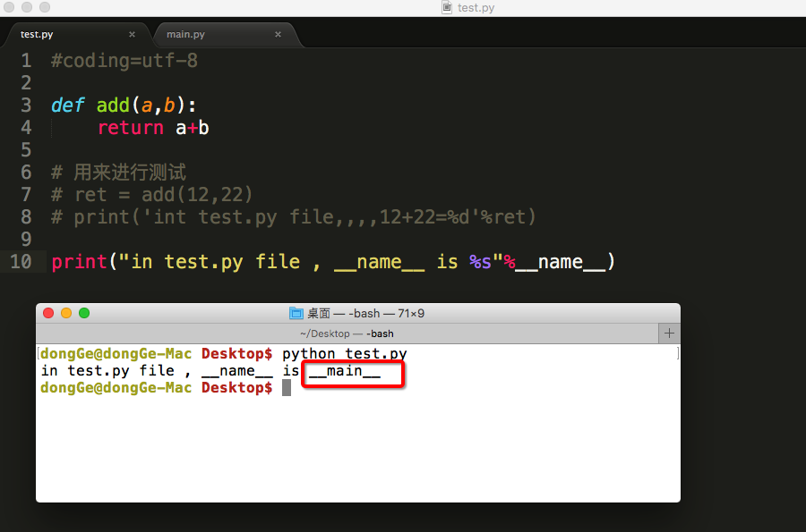
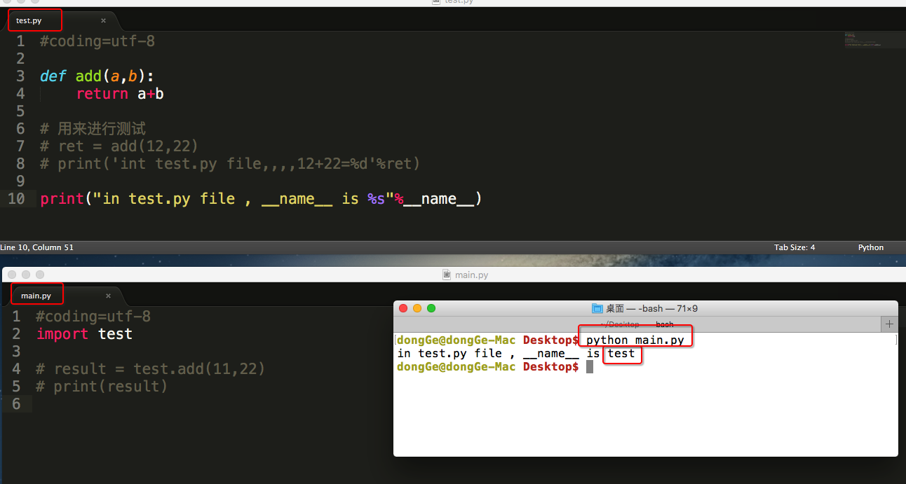
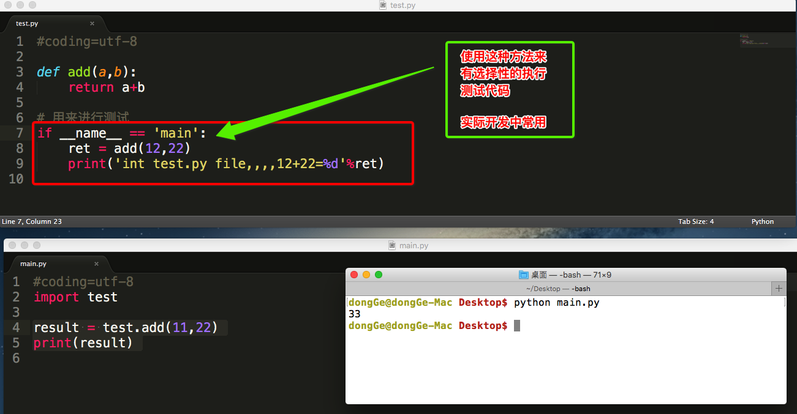
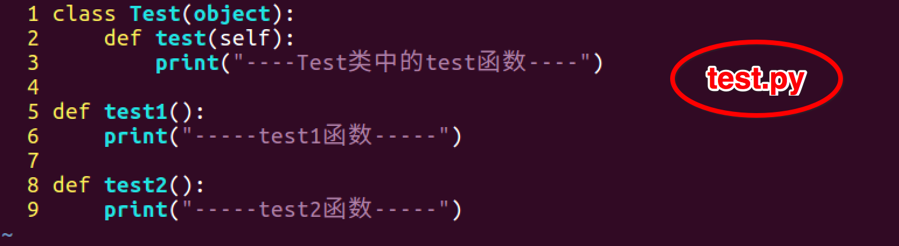
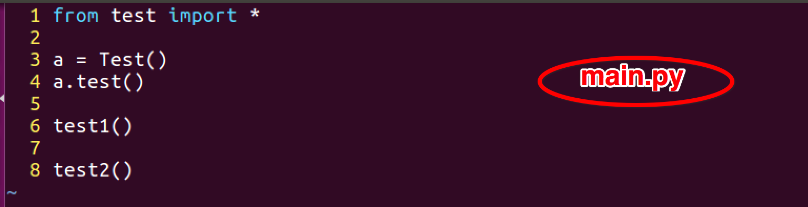
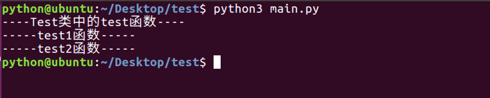
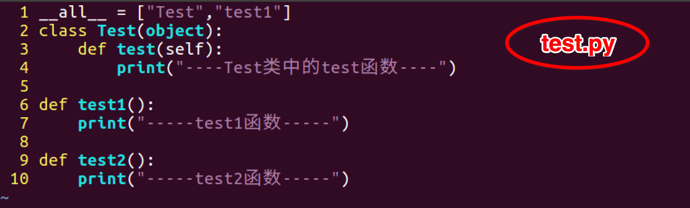

# 
16 模块

## 16.1 模块介绍

- 有过C语言编程经验的朋友都知道在C语言中如果要引用sqrt函数，必须用语句#include <math.h>引入math.h这个头文件，否则是无法正常进行调用的，那么在Python中，如果要引用一些其他的函数，该怎么处理呢？

- 在Python中有一个概念叫做模块（module），这个和C语言中的头文件以及Java中的包很类似，比如在Python中要调用sqrt函数，必须用import关键字引入math这个模块，下面就来了解一下Python中的模块

- 说的通俗点：模块就好比是工具包，要想使用这个工具包中的工具(就好比函数)，就需要导入这个模块。导入模块的方式有以下几种:
  - import 模块名
  - from 模块名 import 功能名
  - from 模块名 import *
  - import 模块名 as 别名
  - from 模块名 import 功能名 as 别名

## 16.2 模块导入方式

### 16.2.1 import

- 在Python中用关键字import来引入某个模块，比如要引用模块math，就可以在文件最开始的地方用import math来引入
    ~~~py
    import module1,mudule2...
    ~~~

- 在调用math模块中的函数时，必须这样引用：
    ~~~py
    模块名.函数名
    ~~~

- 为什么必须加上模块名调用呢？
  - 因为可能存在这样一种情况：在多个模块中含有相同名称的函数，此时如果只是通过函数名来调用，解释器无法知道到底要调用哪个函数。所以如果像上述这样引入模块的时候，调用函数必须加上模块名
    ~~~py
    import math

    #这样会报错
    print(sqrt(2))

    #这样才能正确输出结果
    print(math.sqrt(2))
    ~~~

### 16.2.2 from…import

- 有时候我们只需要用到模块中的某个函数，只需要引入该函数即可，此时可以用下面方法实现：
    ~~~py
    from 模块名 import 函数名1,函数名2....
    ~~~
- 不仅可以引入函数，还可以引入一些全局变量、类等
- 通过这种方式引入的时候，调用函数时只能给出函数名，不能给出模块名，但是当两个模块中含有相同名称函数的时候，后面一次引入会覆盖前一次引入。也就是说假如模块A中有函数function( )，在模块B中也有函数function( )，如果引入A中的function在先、B中的function在后，那么当调用function函数的时候，是去执行模块B中的function函数
    ~~~py
    # 模块1代码
    def my_test(a, b):
        print(a + b)

    # 模块2代码
    def my_test(a, b):
        print(a - b)

    # 导入模块和调用功能代码
    from my_module1 import my_test
    from my_module2 import my_test

    # my_test函数是模块2中的函数
    my_test(1, 1)
    ~~~

### 16.2.3 from … import *

- 把一个模块的所有内容全都导入到当前的命名空间也是可行的，只需使用如下声明：
    ~~~py
    from modname import *
    ~~~
- 这提供了一个简单的方法来导入一个模块中的所有项目。然而这种声明不该被过多地使用

### 16.2.4 import 模块名 as 别名

- `import 模块名 as 别名`叫做模块别名，就是把原来模块的名称改成自己想要的名称，模块改名字后原来的模块名会失效
    ~~~py
    # 1. 模块别名
    import time as tt
    tt.sleep(2)
    # time.sleep(2) # NameError: name 'time' is not defined
    print('hello')
    ~~~

### 16.2.5 from 模块名 import 功能名 as 别名

- `from 模块名 import 功能名 as 别名`叫做功能别名，就是把原来功能的名称改成自己想要的名称，功能改名字后原来的功能名会失效
    ~~~py
    # 2. 功能别名
    from time import sleep as sl
    sl(2)
    # sleep(2) # NameError: name 'sleep' is not defined
    print('hello')
    ~~~

## 16.3 模块制作

### 16.3.1 自定义模块

- 在Python中，每个Python文件都可以作为一个模块，模块的名字就是文件的名字，比如在test.py中定义了函数add
    ~~~py
    def add(a,b):
        return a+b
    ~~~

### 16.3.2 调用自定义模块

- 在其他文件中就可以先import test，然后通过test.add(a,b)来调用了，当然也可以通过from test import add来引入
    ~~~py
    import test

    result = test.add(11,22)
    print(result)
    ~~~

### 16.3.2 测试模块

- 在实际开中，当一个开发人员编写完一个模块后，为了让模块能够在项目中达到想要的效果，这个开发人员会自行在py文件中添加一些测试信息
    ~~~py
    def add(a,b):
        return a+b

    # 用来进行测试
    ret = add(12,22)
    print('int test.py file,,,,12+22=%d'%ret)
    ~~~
    ~~~py
    import test

    result = test.add(11,22)
    print(result)
    ~~~
    ~~~py
    int test.py file,,,,12+22=34
    33
    ~~~
  - 可发现test.py被引用后，里面的测试代码也会被执行。而我们的目的应该是单独执行test.py文件时才应该执行的，不应该是其他的文件中引用而执行

- 为了解决这个问题，python在执行一个文件时有个变量`__name__`，可以根据`__name__`变量的结果能够判断出，是直接执行的python脚本还是被引入执行的，从而能够有选择性的执行测试代码
  - 直接运行此文件

      
    
  - 在其他文件中import此文件

      

  - 根据`__name__`变量的结果能够判断

      

## 16.4 `__all__`

- 没有`__all__`

      

      

      

- 有`__all__`

      

      

- 总结：如果一个文件中有`__all__`变量，那么也就意味着不在这个变量中的元素，不会被`from xxx import *`时导入

## 16.5 包

- 包将有联系的模块组织在一起，即放到同一个文件夹下，并且在这个文件夹创建一个名字为`__init__.py` 文件，那么这个文件夹就称之为包

### 16.5.1 制作包

- New → Python Package → 输入包名 → OK → 新建功能模块(有联系的模块)

- 注意：新建包后，包内部会自动创建`__init__.py`文件，这个文件控制着包的导入行为

- 新建包mypackage → 新建包内模块：my_module1 和 my_module2
    ~~~py
    # my_module1
    print(1)

    def info_print1():
        print('my_module1')
    ~~~
    ~~~py
    # my_module2
    print(2)

    def info_print2():
        print('my_module2')
    ~~~

### 16.5.2 导入包

- 方法一
    ~~~py
    import 包名.模块名

    包名.模块名.目标
    ~~~
    ~~~py
    import my_package.my_module1

    my_package.my_module1.info_print1()
    ~~~

- 方法二
    ~~~py
    from 包名 import *
    模块名.目标
    ~~~
    ~~~py
    from my_package import *

    my_module1.info_print1()
    ~~~
  - 注意：必须在`__init__.py`文件中添加`__all__ = []`，控制允许导入的模块列表

