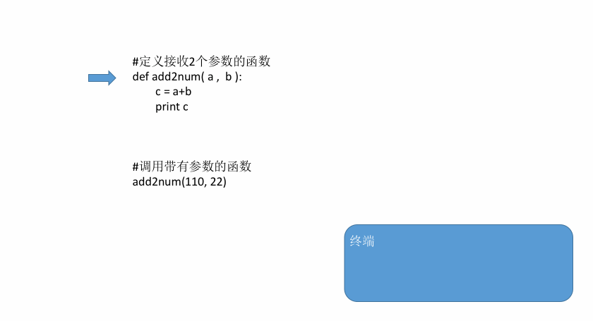

# 
17 函数

## 17.1 函数介绍

- 如果在开发程序时，需要某块代码多次，但是为了提高编写的效率以及代码的重用，所以把具有独立功能的代码块组织为一个小模块，这就是函数

- 定义函数
    ~~~py
    def 函数名():
        代码
    ~~~
    ~~~py
    # 定义一个函数，能够完成打印信息的功能
    def printInfo():
        print('------------------------------------')
        print('         人生苦短，我用Python')
        print('------------------------------------')
    ~~~

- 调用函数
  - 定义了函数之后，就相当于有了一个具有某些功能的代码，想要让这些代码能够执行，需要调用它调用函数很简单的，通过 函数名() 即可完成调用
    ~~~py
    # 定义完函数后，函数是不会自动执行的，需要调用它才可以
    printInfo()
    ~~~

- 注意：
  - 每次调用函数时，函数都会从头开始执行，当这个函数中的代码执行完毕后，意味着调用结束了
  - 当然了如果函数中执行到了return也会结束函数

## 17.2 函数的参数

- 定义带有参数的函数
    ~~~py
    def add2num(a, b):
        c = a+b
        print c
    ~~~

- 调用带有参数的函数
    ~~~py
    def add2num(a, b):
        c = a+b
        print c

    add2num(11, 22) # 调用带有参数的函数时，需要在小括号中，传递数据
    ~~~

- 调用带有参数函数的运行过程：

      

## 17.3 函数的返回值

- 带有返回值的函数
    ~~~py
    def add2num(a, b):
        c = a+b
        return c
    ~~~

- 保存函数的返回值
    ~~~py
    #定义函数
    def add2num(a, b):
        return a+b

    #调用函数，顺便保存函数的返回值
    result = add2num(100,98)

    #因为result已经保存了add2num的返回值，所以接下来就可以使用了
    print(result)
    ~~~

## 17.4 局部变量和全局变量

- 局部变量：就是在函数内部定义的变量
  - 其作用范围是这个函数内部，即只能在这个函数中使用，在函数的外部是不能使用的
  - 因为其作用范围只是在自己的函数内部，所以不同的函数可以定义相同名字的局部变量（打个比方，把你、我是当做成函数，把局部变量理解为每个人手里的手机，你可有个iPhone8，- 我当然也可以有个iPhone8了， 互不相关）
  - 局部变量的作用，为了临时保存数据需要在函数中定义变量来进行存储
  - 当函数调用时，局部变量被创建，当函数调用完成后这个变量就不能够使用了

- 全局变量：在函数外边定义的变量叫做全局变量
  - 全局变量能够在所有的函数中进行访问
  - 当函数内出现局部变量和全局变量相同名字时，函数内部中的 变量名 = 数据 此时理解为定义了一个局部变量，而不是修改全局变量的值

- 修改全局变量
    ~~~py
    a = 100

    print(a)

    def testA():
        print(a)

    def testB():
        # a = 200  # 如果直接修改a=200，此时的a是全局a还是局部a？ -- 得到结论：这个a是局部变量
        # # 因为在全局位置(B函数调用后)打印a得到的不是200而是100
        # print(a)

        # 想要修改全局变量a，值是200
        global a  # 声明a为全局变量
        a = 200
        print(a)

    testA()
    testB()
    ~~~
  - 如果在函数中出现global 全局变量的名字 那么这个函数中即使出现和全局变量名相同的变量名 = 数据 也理解为对全局变量进行修改，而不是定义局部变量
  - 如果在一个函数中需要对多个全局变量进行修改，那么可以使用
    ~~~py
     # 可以使用一次global对多个全局变量进行声明
     global a, b
     # 还可以用多次global声明都是可以的
     # global a
     # global b
    ~~~

## 17.5 拆包

## 17.6 引用

## 17.7 可变和不可变类型

## 17.8 函数的文档说明

