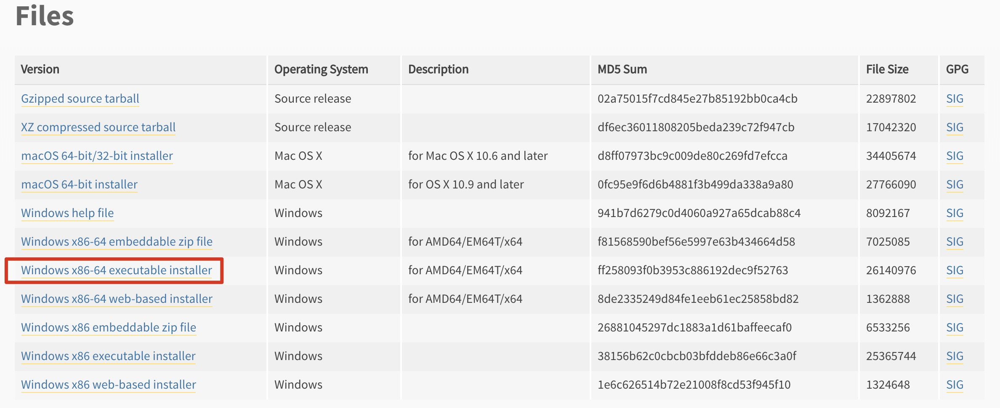

# 
2 Python 环境安装

## 2.1 Python 解释器

### 2.1.1 解释器的作用

- Python解释器作用：运行文件
- Python解释器种类
  - CPython：C语言开发的解释器(官方)，应用广泛的解释器
  - IPython：基于CPython的一种交互式解释器
  - 其他解释器
    - PyPy：基于Python语言开发的解释器
    - Jython：运行在Java平台的解释器，直接把Python代码编译成Java字节码执行
    - IronPython：运行在微软.Net平台上的Python解释器，可以直接把Python代码编译成.Net的字节码

### 2.1.2 下载解释器

- 下载地址：https://www.python.org/downloads/release/python-372/
- 单击上述链接→查找目标文件：Windows x86-64 executable installer →单击即可下载

      

### 2.1.3 安装解释器

1. 选择在path中配置python3.6环境变量，然后尊则现在安装

    

2. 等待程序安装

    

3. 选择关闭

    

 

- **注意：如果第一步未选择Add python 3.6 to Path，则需要手动配置环境变量**

- **手动配置环境变量步骤**

  1. 右键点击此电脑，选择属性选项

      

  2. 选择高级系统设置

      

  3. 选择环境变量

      

  4. 选择用户变量中的Path变量，点击编辑

      

  5. 双击打开我的电脑，在搜索栏输入python.exe并搜索找到对应搜索结果，有点选择打开文件所在位置

      

  6. 赋值python文件所在位置的完整路径

      

  7. 回到环境变量，选择新建，并将刚才赋值的路径填入其中

      

  8. 再次点击新建，将刚才的路径粘贴到其中，并在结尾添加`\Scripts`

      

  9. 使用windows + R键调出运行窗口，输入cmd命令，点击确定

      

  10. 在命令行中输入python，并回车，如果出现如图所示版本信息即为配置完成

      

## 2.2 PyCharm

### 2.2.1 PyCharm 的作用

- PyCharm是一种Python IDE（集成开发环境），带有一整套可以帮助用户在使用Python语言开发时提高其效率的工具，内部集成的功能如下：
  - Project管理
  - 智能提示
  - 语法高亮
  - 代码跳转
  - 调试代码
  - 解释代码(解释器)
  - 框架和库
  - ......

### 2.2.2 PyCharm 下载

- 下载地址：http://www.jetbrains.com/pycharm/download/#section=windows
- 下载专业版

### 2.2.3 PyCharm 破解教程

1. 破解文件下载：链接：https://pan.baidu.com/s/1zNjCkSgYQ9q1Fk5IL1AonA?pwd=p55x 
2. 破解教程：https://www.exception.site/essay/how-to-free-use-pycharm-2020
3. 设置中文：https://www.zcscl.com/p/5869.html
4. 关闭自动更新：https://www.csdn.net/tags/MtTaAg3sNTA5NDM3LWJsb2cO0O0O.html
5. 新建项目：https://blog.csdn.net/lehocat/article/details/123579981