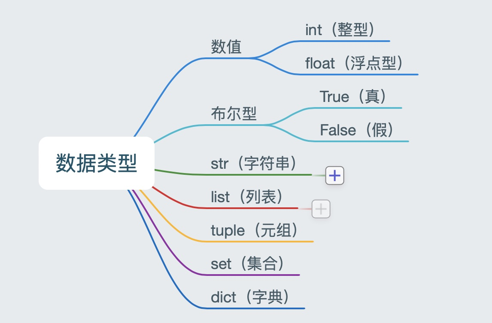

# <center>4 数据类型

### 4.1 认识数据类型

- 在 Python 里为了应对不同的业务需求，也把数据分为不同的类型

      

- 检测数据类型的方法：`type()`
    ```python
    a = 1
    print(type(a))  # <class 'int'> -- 整型

    b = 1.1
    print(type(b))  # <class 'float'> -- 浮点型

    c = True
    print(type(c))  # <class 'bool'> -- 布尔型

    d = '12345'
    print(type(d))  # <class 'str'> -- 字符串

    e = [10, 20, 30]
    print(type(e))  # <class 'list'> -- 列表

    f = (10, 20, 30)
    print(type(f))  # <class 'tuple'> -- 元组

    h = {10, 20, 30}
    print(type(h))  # <class 'set'> -- 集合

    g = {'name': 'TOM', 'age': 20}
    print(type(g))  # <class 'dict'> -- 字典
    ```

### 4.2 数据类型转换

- 转换数据类型的函数

|          函数          |                        说明                         |
| :--------------------: | :-------------------------------------------------: |
|    int(x [,base ])     |                  将x转换为一个整数                  |
|       float(x)        |                 将x转换为一个浮点数                 |
| complex(real [,imag ]) |        创建一个复数，real为实部，imag为虚部         |
|        str(x)         |                将对象 x 转换为字符串                |
|        repr(x)        |             将对象 x 转换为表达式字符串             |
|       eval(str)       | 用来计算在字符串中的有效Python表达式,并返回一个对象 |
|       tuple(s)        |               将序列 s 转换为一个元组               |
|        list(s)        |               将序列 s 转换为一个列表               |
|        chr(x)         |           将一个整数转换为一个Unicode字符           |
|        ord(x)         |           将一个字符转换为它的ASCII整数值           |
|        hex(x)         |         将一个整数转换为一个十六进制字符串          |
|        oct(x)         |          将一个整数转换为一个八进制字符串           |
|        bin(x)         |          将一个整数转换为一个二进制字符串           |

``` python
# 1. float() -- 转换成浮点型
num1 = 1
print(float(num1))
print(type(float(num1)))

# 2. str() -- 转换成字符串类型
num2 = 10
print(type(str(num2)))

# 3. tuple() -- 将一个序列转换成元组
list1 = [10, 20, 30]
print(tuple(list1))
print(type(tuple(list1)))


# 4. list() -- 将一个序列转换成列表
t1 = (100, 200, 300)
print(list(t1))
print(type(list(t1)))

# 5. eval() -- 将字符串中的数据转换成Python表达式原本类型
str1 = '10'
str2 = '[1, 2, 3]'
str3 = '(1000, 2000, 3000)'
print(type(eval(str1)))
print(type(eval(str2)))
print(type(eval(str3)))
```

