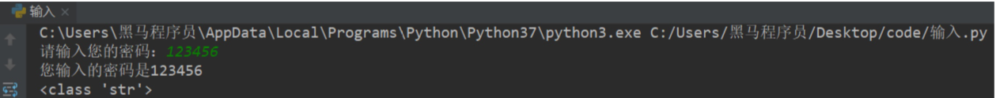

# <center>5 输入

- 输入的语法
    ```python
    input("提示信息")
    ```

- 输入的特点
  - 当程序执行到`input`，等待用户输入，输入完成之后才继续向下执行
  - 在Python中，`input`接收用户输入后，一般存储到变量，方便使用
  - 在Python中，`input`会把接收到的任意用户输入的数据都当做字符串处理


```python
password = input('请输入您的密码：')

print(f'您输入的密码是{password}')
# <class 'str'>
print(type(password))
```
控制台输出结果如下：

  


