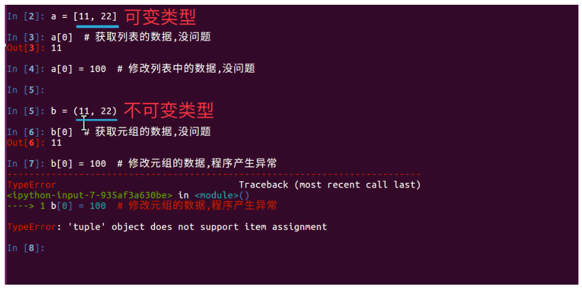
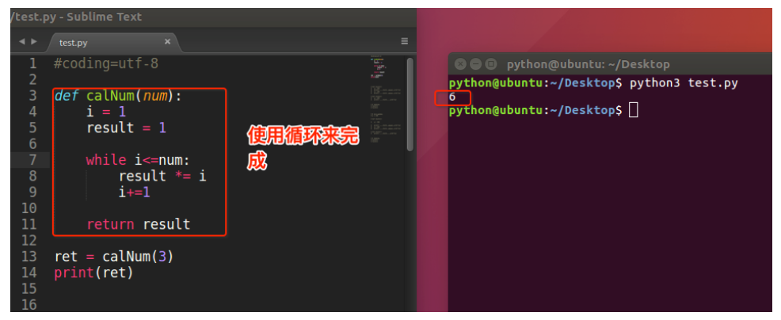
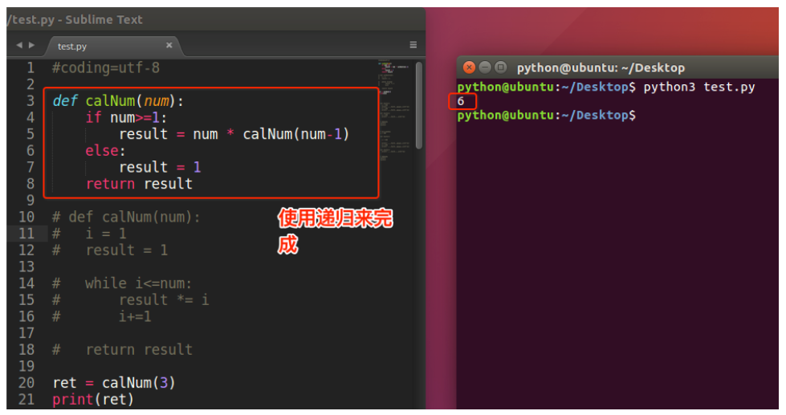
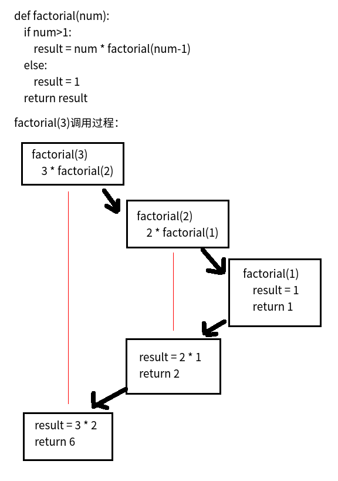

# 
12 函数

## 12.1 函数介绍

- 如果在开发程序时，需要某块代码多次，但是为了提高编写的效率以及代码的重用，所以把具有独立功能的代码块组织为一个小模块，这就是函数

- 定义函数
    ~~~py
    def 函数名():
        代码
    ~~~
    ~~~py
    # 定义一个函数，能够完成打印信息的功能
    def printInfo():
        print('------------------------------------')
        print('         人生苦短，我用Python')
        print('------------------------------------')
    ~~~

- 调用函数
  - 定义了函数之后，就相当于有了一个具有某些功能的代码，想要让这些代码能够执行，需要调用它调用函数很简单的，通过 函数名() 即可完成调用
    ~~~py
    # 定义完函数后，函数是不会自动执行的，需要调用它才可以
    printInfo()
    ~~~

- 注意：
  - 每次调用函数时，函数都会从头开始执行，当这个函数中的代码执行完毕后，意味着调用结束了
  - 当然了如果函数中执行到了return也会结束函数

## 12.2 函数的参数

- 定义带有参数的函数
    ~~~py
    def add2num(a, b):
        c = a+b
        print c
    ~~~

- 调用带有参数的函数
    ~~~py
    def add2num(a, b):
        c = a+b
        print c

    add2num(11, 22) # 调用带有参数的函数时，需要在小括号中，传递数据
    ~~~

- 调用带有参数函数的运行过程：

      

### 12.2.1 位置参数

- 位置参数：调用函数时根据函数定义的参数位置来传递参数
    ~~~py
    def user_info(name, age, gender):
        print(f'您的名字是{name}, 年龄是{age}, 性别是{gender}')

    user_info('TOM', 20, '男')
    ~~~
  - 注意：传递和定义参数的顺序及个数必须一致

### 12.2.2 关键字参数

- 关键字参数：通过“键=值”形式加以指定，可以让函数更加清晰、容易使用，同时也清除了参数的顺序需求
    ~~~py
    def user_info(name, age, gender):
        print(f'您的名字是{name}, 年龄是{age}, 性别是{gender}')

    user_info('Rose', age=20, gender='女')
    user_info('小明', gender='男', age=16)
    ~~~
  - 注意：函数调用时，如果有位置参数时，位置参数必须在关键字参数的前面，但关键字参数之间不存在先后顺序

### 12.2.3 缺省参数

- 缺省参数：调用函数时，缺省参数的值如果没有传入，则取默认值
    ~~~py
    def printinfo(name, age=35):
    # 打印任何传入的字符串
    print("name: %s" % name)
    print("age %d" % age)

    # 调用printinfo函数
    printinfo(name="miki")  # 在函数执行过程中 age去默认值35
    printinfo(age=9 ,name="miki")
    ~~~
    ~~~py
    name: miki
    age: 35
    name: miki
    age: 9
    ~~~
  - 在形参中默认有值的参数，称之为缺省参数
  - 注意：带有默认值的参数一定要位于参数列表的最后面，否则会报错
    ~~~py
    def printinfo(name, age=35, sex):
        print name

    File "<stdin>", line 1 SyntaxError: non-default argument follows default argument
    ~~~

### 12.2.4 不定长参数

- 不定长参数：有时可能需要一个函数能处理比当初声明时更多的参数, 这些参数叫做不定长参数，声明时不会命名
    ~~~py
    def functionname([formal_args,] *args, **kwargs):
    """函数_文档字符串"""
    function_suite
    return [expression]
    ~~~
  - 加了星号（*）的变量args会存放所有未命名的变量参数，args为元组
  - 而加**的变量kwargs会存放命名参数，即形如key=value的参数， kwargs为字典
    ~~~py
    def fun(a, b, *args, **kwargs):
        """可变参数演示示例"""
        print("a =%d" % a)
        print("b =%d" % b)
        print("args:")
        print(args)
        print("kwargs: ")
        for key, value in kwargs.items():
            print("key=%s" % value)
    fun(1, 2, 3, 4, 5, m=6, n=7, p=8)  # 注意传递的参数对应
    ~~~
    ~~~py
    a = 1
    b = 2
    args:
    (3, 4, 5)
    kwargs: 
    p = 8
    m = 6
    n = 7
    ~~~

- 缺省参数在*args后面
    ~~~py
    def sum_nums_3(a, *args, b=22, c=33, **kwargs):
        print(a)
        print(b)
        print(c)
        print(args)
        print(kwargs)

    sum_nums_3(100, 200, 300, 400, 500, 600, 700, b=1, c=2, mm=800, nn=900)
    ~~~
    ~~~py
    100
    1
    2
    (200, 300, 400, 500, 600, 700)
    {'mm': 800, 'nn': 900}
    ~~~
  - 如果很多个值都是不定长参数，那么这种情况下，可以将缺省参数放到 *args的后面， 但如果有`**kwargs`的话，`**kwargs`必须是最后的

## 12.3 函数的返回值

- 带有返回值的函数
    ~~~py
    def add2num(a, b):
        c = a+b
        return c
    ~~~

- 保存函数的返回值
    ~~~py
    # 定义函数
    def add2num(a, b):
        return a+b

    # 调用函数，顺便保存函数的返回值
    result = add2num(100,98)

    # 因为result已经保存了add2num的返回值，所以接下来就可以使用了
    print(result)
    ~~~

- 一个函数中可以有多个return语句，但是只要有一个return语句被执行到，那么这个函数就会结束了，因此后面的return没有什么用处
    ~~~py
    def create_nums():
        print("---1---")
        return 1  # 函数中下面的代码不会被执行，因为return除了能够将数据返回之外，还有一个隐藏的功能：结束函数
        print("---2---")
        return 2
        print("---3---")
    ~~~
  - 如果程序设计为如下，是可以的因为不同的场景下执行不同的return
    ~~~py
    def create_nums(num):
        print("---1---")
        if num == 100:
            print("---2---")
            return num+1  # 函数中下面的代码不会被执行，因为return除了能够将数据返回之外，还有一个隐藏的功能：结束函数
        else:
            print("---3---")
            return num+2
        print("---4---")

    result1 = create_nums(100)
    print(result1)  # 打印101
    result2 = create_nums(200)
    print(result2)  # 打印202
    ~~~

- 一个函数返回多个数据的方式
    ~~~py
    def divid(a, b):
        shang = a//b
        yushu = a%b 
        return shang, yushu  #默认是元组

    result = divid(5, 2)
    print(result)  # 输出(2, 1)
    ~~~
    ~~~py
    def function():
        # return [1, 2, 3]
        # return (1, 2, 3)
        return {"num1": 1, "num2": 2, "num3": 3}
    ~~~
  - return后面可以是元组，列表、字典等，只要是能够存储多个数据的类型，就可以一次性返回多个数据；如果return后面有多个数据，那么默认是元组

## 12.4 局部变量和全局变量

- 局部变量：就是在函数内部定义的变量
  - 其作用范围是这个函数内部，即只能在这个函数中使用，在函数的外部是不能使用的
  - 因为其作用范围只是在自己的函数内部，所以不同的函数可以定义相同名字的局部变量（打个比方，把你、我是当做成函数，把局部变量理解为每个人手里的手机，你可有个iPhone8，- 我当然也可以有个iPhone8了， 互不相关）
  - 局部变量的作用，为了临时保存数据需要在函数中定义变量来进行存储
  - 当函数调用时，局部变量被创建，当函数调用完成后这个变量就不能够使用了

- 全局变量：在函数外边定义的变量叫做全局变量
  - 全局变量能够在所有的函数中进行访问
  - 当函数内出现局部变量和全局变量相同名字时，函数内部中的 变量名 = 数据 此时理解为定义了一个局部变量，而不是修改全局变量的值

- 修改全局变量
    ~~~py
    a = 100

    print(a)

    def testA():
        print(a)

    def testB():
        # a = 200  # 如果直接修改a=200，此时的a是全局a还是局部a？ -- 得到结论：这个a是局部变量
        # # 因为在全局位置(B函数调用后)打印a得到的不是200而是100
        # print(a)

        # 想要修改全局变量a，值是200
        global a  # 声明a为全局变量
        a = 200
        print(a)

    testA()
    testB()
    ~~~
  - 如果在函数中出现global 全局变量的名字 那么这个函数中即使出现和全局变量名相同的变量名 = 数据 也理解为对全局变量进行修改，而不是定义局部变量
  - 如果在一个函数中需要对多个全局变量进行修改，那么可以使用
    ~~~py
     # 可以使用一次global对多个全局变量进行声明
     global a, b
     # 还可以用多次global声明都是可以的
     # global a
     # global b
    ~~~

## 12.5 拆包

- 拆包时要注意，需要拆的数据的个数要与变量的个数相同，否则程序会异常
- 除了对元组拆包之外，还可以对列表、字典等拆包
    ~~~py
    # 1. 拆包元组数据
    def return_num():
        return 100, 200

    result = return_num()
    print(result)
    num1, num2 = return_num()
    print(num1)
    print(num2)

    # 2. 字典数据拆包: 变量存储的数据是key值
    # 先准备字典，然后拆包
    dict1 = {'name': 'TOM', 'age': 20}
    # dict1中有两个键值对，拆包的时候用两个变量接收数据
    a, b = dict1
    print(a)
    print(b)

    # v值
    print(dict1[a])
    print(dict1[b])
    ~~~
    ~~~py
    (100, 200)
    100
    200
    name
    age
    TOM
    20
    ~~~

- 交换2个变量的值
    ~~~py
    # 第1种方式
    a = 4
    b = 5
    c = 0

    c = a
    a = b
    b = c

    # 第2种方式
    a = 4
    b = 5
    a = a+b  # a=9, b=5
    b = a-b  # a=9, b=4
    a = a-b  # a=5, b=4

    # 第3种方式
    a, b = 4, 5
    a, b = b, a
    ~~~

## 12.6 引用

- 在python中，值是靠引用来传递来的，我们可以用id()来判断两个变量是否为同一个值的引用。 我们可以将id值理解为那块内存的地址标示
    ~~~py
    a = 1
    b = a
    id(a) # 13033816
    id(b) # 13033816 
    # 注意两个变量的id值相同
    
    a = 2
    # 注意a的id值已经变了
    id(a)  # 13033792
    # b的id值依旧
    id(b)  # 13033816
    ~~~
    ~~~py
    a = [1, 2]
    b = a
    id(a) # 139935018544808
    id(b) # 139935018544808

    a.append(3) # a=[1, 2, 3]
    
    id(a) # 139935018544808
    id(b) # 139935018544808
    # 注意a与b始终指向同一个地址
    ~~~
  - Python中函数参数是引用传递（注意不是值传递）
  - 对于不可变类型，因变量不能修改，所以运算不会影响到变量自身
  - 而对于可变类型来说，函数体中的运算有可能会更改传入的参数变量

- 可变和不可变类型
  - 所谓可变类型与不可变类型是指：数据能够直接进行修改，如果能直接修改那么就是可变，否则是不可变
  - 可变类型有： 列表、字典、集合
  - 不可变类型有： 数字、字符串、元组

  

## 12.7 函数的文档说明

- 定义函数的说明文档
    ~~~py
    def 函数名(参数):
        """ 说明文档的位置 """
        代码
        ......
    ~~~
- 查看函数的说明文档
    ~~~py
    help(函数名)
    ~~~
    ~~~
    def sum_num1(a, b):
        """
        求和函数sum_num1
        :param a: 参数1
        :param b: 参数2
        :return: 返回值
        """
        return a + b

    help(sum_num1)
    ~~~
    ~~~py
    Help on function sum_num1 in module __main__:

    sum_num1(a, b)
        求和函数sum_num1
        :param a: 参数1
        :param b: 参数2
        :return: 返回值
    ~~~

## 12.8 递归函数

- 如果一个函数在内部不调用其它的函数，而是自己本身的话，这个函数就是递归函数

- 举个例子，我们来计算阶乘 n! = 1 * 2 * 3 * ... * n
  - 阶乘的规律
    ~~~py
    1! = 1
    2! = 2 × 1 = 2 × 1!
    3! = 3 × 2 × 1 = 3 × 2!
    4! = 4 × 3 × 2 × 1 = 4 × 3!
    ...
    n! = n × (n-1)!
    ~~~
  - 解决办法1:循环

     

  - 解决办法2:递归

      

- 原理

      

- 总结
  - 函数内部自己调用自己
  - 必须有终止条件(即必须有出口)

## 12.9 匿名函数

### 12.9.1 匿名函数介绍

- 定义的函数没有名字,这样的函数叫做匿名函数
- 语法结构:
    ~~~py
    lambda [形参1], [形参2], ... : [单行表达式] 或 [函数调用]
    ~~~
  - 使用匿名函数, 上面的函数我们就可以定义为单行的函数
    ~~~py
    # 不带参数
    my_fun = lambda : 10 + 20
    # 带参数
    my_add = lambda a, b: a + b
    my_add()
    ~~~
- 注意：
  - lambda表达式的参数可有可无，函数的参数在lambda表达式中完全适用
  - lambda表达式能接收任何数量的参数但只能返回一个表达式的值

- 匿名函数和普通函数的区别
  - 匿名函数中不能使用 while 循环、for 循环, 只能编写单行的表达式，或函数调用, 普通函数都可以
  - 匿名函数中返回结果不需要使用 return, 表达式的运行结果就是返回结果, 普通函数返回结果必须 return
  - 匿名函数中也可以不返回结果. 例如: lambda : print('hello world')

- 定义简单的单行函数
  - 普通函数：
    ~~~py
    def my_function(a, b):
        return a + b
    ~~~
  - 匿名函数：
    ~~~py
    my_function = lambda a, b: a + b
    ~~~

### 12.9.2 匿名函数的参数

- 无参数
    ~~~py
    fn1 = lambda: 100
    print(fn1())
    ~~~

- 一个参数
    ~~~py
    fn1 = lambda a: a
    print(fn1('hello world'))
    ~~~

- 默认参数
    ~~~py
    fn1 = lambda a, b, c=100: a + b + c
    print(fn1(10, 20))
    ~~~

- 可变参数：*args
    ~~~py
    fn1 = lambda *args: args
    print(fn1(10, 20, 30))
        ~~~
    - 注意：这里的可变参数传入到lambda之后，返回值为元组

- 可变参数：**kwargs
    ~~~py
    fn1 = lambda **kwargs: kwargs
    print(fn1(name='python', age=20))
    ~~~    

### 12.9.3 匿名函数的应用

- 匿名函数做为函数参数
    ~~~py
    def my_function(func):
        a = 100
        b = 200
        # 把 cucalate_rule 当做函数来调用
        result = func(a, b)
        print('result:', result)

    my_function(lambda a, b: a / b)
    my_function(lambda a, b: a // b)
    my_function(lambda a, b: a % b)
    ~~~    
  - 函数可以做为参数传递给另外一个函数, 可以使得函数的实现更加通用
  - 匿名函数也可以作为参数传递给另外一个函数, 对于只需要用到一次函数, 可以通过匿名函数减少代码量

- 带判断的lambda
    ~~~py
    fn1 = lambda a, b: a if a > b else b
    print(fn1(1000, 500))
    ~~~ 

- 列表数据按字典key的值排序
    ~~~py
    students = [
        {'name': 'TOM', 'age': 20},
        {'name': 'ROSE', 'age': 19},
        {'name': 'Jack', 'age': 22}
    ]

    # 按name值升序排列
    students.sort(key=lambda x: x['name'])
    print(students)

    # 按name值降序排列
    students.sort(key=lambda x: x['name'], reverse=True)
    print(students)

    # 按age值升序排列
    students.sort(key=lambda x: x['age'])
    print(students)
    ~~~ 

## 12.10 高阶函数

### 12.10.1 高阶函数介绍

- 把函数作为参数传入，这样的函数称为高阶函数，高阶函数是函数式编程的体现。函数式编程就是指这种高度抽象的编程范式
    ~~~py
    def sum_num(a, b, f):
        return f(a) + f(b)

    result = sum_num(-1, 2, abs)
    print(result)  # 3
    ~~~

### 12.10.2 内置高阶函数

- map(function, list)：会根据提供的函数对指定序列做映射，第一个参数 function 以参数序列中的每一个元素调用 function 函数，返回包含每次 function 函数返回值的新列表
    ~~~py
    # 计算每一个元素的平方值
    my_list = [1, 2, 3, 4, 5]

    def f(x):
        return x ** 2

    result = map(f, my_list)
    print(type(result), result, list(result)) # <class 'map'> <map object at 0x000000C9729591D0> [1, 4, 9, 16, 25]
    ~~~
    ~~~py
    # 首字母大写
    my_list = ['smith', 'edward', 'john', 'obama', 'tom']

    def f(x):
        return x[0].upper() + x[1:]

    result = map(f, my_list)
    print(list(result)) # ['Smith', 'Edward', 'John', 'Obama', 'Tom']
    ~~~

- reduce(function, list)：函数会对参数序列中元素进行累计，函数将一个数据集合中的所有数据进行下列操作:① 用传给 reduce 中的函数 function（有两个参数）先对集合中的第 1、2 个元素进行操作；② 得到的结果继续和序列的下一个元素做累积计算， 最终得到一个结果
    ~~~py
    # 计算列表中的累加和
    import functools

    my_list = [1, 2, 3, 4, 5]

    def f(x1, x2):
        return x1 + x2

    result = functools.reduce(f, my_list)
    print(result) # 15
    ~~~
 

- filter()：函数用于过滤序列， 过滤掉不符合条件的元素， 返回一个 filter 对象， 如果要转换为列表， 可以使用 list() 来转换。filter() 接收两个参数， 第一个为函数， 第二个为序列， 序列的每个元素作为参数传递给函数进行判断， 然后返回 True 或 False， 最后将返回 True 的元素放到新列表中
    ~~~py
    # 过滤掉列表中的奇数
    my_list = [1, 2, 3, 4, 5, 6, 7, 8, 9, 10]

    def f(x):
        return x % 2 == 0

    result = filter(f, my_list)
    print(list(result)) # [2, 4, 6, 8, 10]
    ~~~
    ~~~py
    # 过滤掉列表中首字母为小写的单词
    my_list = ['edward', 'Smith', 'Obama', 'john', 'tom']

    def f(x):
        return x[0].isupper()

    result = filter(f, my_list)
    print(list(result)) # ['Smith', 'Obama']
    ~~~

