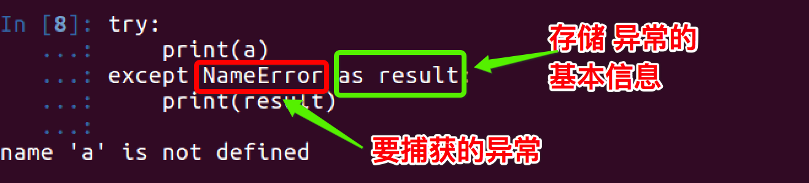
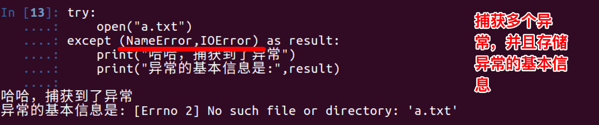
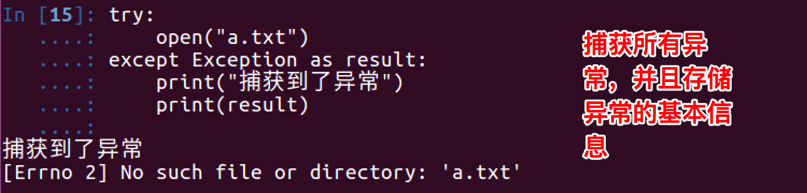
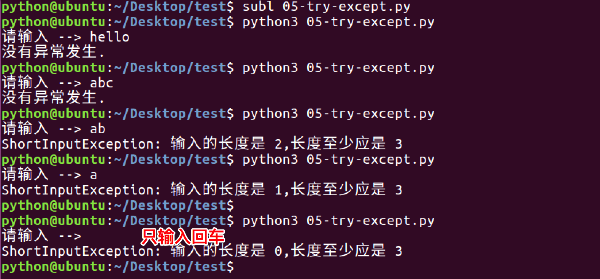

# 
15 异常

## 15.1 异常介绍

- 看如下示例:
    ~~~py
    print('-----test--1---')
    open('123.txt','r')
    print('-----test--2---')
    ~~~
    ~~~py
    FileNotFoundError: [Errno 2] No such file or directory: '123.txt'
    ~~~

- 打开一个不存在的文件123.txt，当找不到123.txt 文件时，就会抛出给我们一个IOError类型的错误，No such file or directory：123.txt （没有123.txt这样的文件或目录）
- 当Python检测到一个错误时，解释器就无法继续执行了，反而出现了一些错误的提示，这就是所谓的"异常"

## 15.2 捕获异常

### 15.2.1 捕获异常介绍

- 语法：
    ~~~py
    try:
        可能发生错误的代码
    except 异常类型:
        如果出现异常执行的代码
    ~~~

- 示例:
    ~~~py
    try:
        print('-----test--1---')
        open('123.txt','r')
        print('-----test--2---')
    except IOError:
        pass
    ~~~

      

  - 此程序看不到任何错误，因为用except 捕获到了IOError异常，并添加了处理的方法
  - pass 表示实现了相应的实现，但什么也不做；如果把pass改为print语句，那么就会输出其他信息

- 总结:把可能出现问题的代码，放在try中，把处理异常的代码，放在except中

      

### 15.2.2 捕获多个异常

- 示例:
    ~~~py
    try:
        print num
    except IOError:
        print('产生错误了')
    ~~~

      

- 上例程序，已经使用except来捕获异常了，为什么还会看到错误的信息提示？
  - except捕获的错误类型是IOError，而此时程序产生的异常为 NameError ，所以except没有生效

- 修改后的代码为:
    ~~~py
    try:
        print num
    except NameError:
        print('产生错误了')
    ~~~

      

- 实际开发中，捕获多个异常的方式，如下：
    ~~~py
    try:
        print('-----test--1---')
        open('123.txt','r') # 如果123.txt文件不存在，那么会产生 IOError 异常
        print('-----test--2---')
        print(num)# 如果num变量没有定义，那么会产生 NameError 异常

    except (IOError,NameError): 
        #如果想通过一次except捕获到多个异常可以用一个元组的方式
    ~~~
  - 当捕获多个异常时，可以把要捕获的异常的名字，放到except 后，并使用元组的方式仅进行存储

### 15.2.3 获取异常的信息描述

  

  

### 15.2.4 捕获所有异常

  

  

### 15.2.5 else

- 咱们应该对else并不陌生，在if中，它的作用是当条件不满足时执行的实行；同样在try...except...中也是如此，即如果没有捕获到异常，那么就执行else中的事情
    ~~~py
    try:
        num = 100
        print num
    except NameError as errorMsg:
        print('产生错误了:%s'%errorMsg)
    else:
        print('没有捕获到异常，真高兴')
    ~~~

      

### 15.2.6 try...finally...

- try...finally...语句用来表达这样的情况：在程序中，如果一个段代码必须要执行，即无论异常是否产生都要执行，那么此时就需要使用finally。 比如文件关闭，释放锁，把数据库连接返还给连接池等
    ~~~py
    import time
    try:
        f = open('test.txt')
        try:
            while True:
                content = f.readline()
                if len(content) == 0:
                    break
                time.sleep(2)
                print(content)
        except:
            #如果在读取文件的过程中，产生了异常，那么就会捕获到
            #比如 按下了 ctrl+F2
            pass
        finally:
            f.close()
            print('关闭文件')
    except:
        print("没有这个文件")
    ~~~
  - test.txt文件中每一行数据打印，但是我有意在每打印一行之前用time.sleep方法暂停2秒钟。这样做的原因是让程序运行得慢一些。在程序运行的时候，按Ctrl+F2中断（取消）程序
  - 我们可以观察到KeyboardInterrupt异常被触发，程序退出。但是在程序退出之前，finally从句仍然被执行，把文件关闭

## 15.3 异常的传递

- try嵌套中
    ~~~py
    import time
    try:
        f = open('test.txt')
        try:
            while True:
                content = f.readline()
                if len(content) == 0:
                    break
                time.sleep(2)
                print(content)
        finally:
            f.close()
            print('关闭文件')
    except:
        print("没有这个文件")
    ~~~
  - 如果try嵌套，那么如果里面的try没有捕获到这个异常，那么外面的try会接收到这个异常，然后进行处理，如果外边的try依然没有捕获到，那么再进行传递

- 函数嵌套调用中
    ~~~py
    def test1():
        print("----test1-1----")
        print(num)
        print("----test1-2----")

    def test2():
        print("----test2-1----")
        test1()
        print("----test2-2----")

    def test3():
        try:
            print("----test3-1----")
            test1()
            print("----test3-2----")
        except Exception as result:
            print("捕获到了异常，信息是:%s"%result)

        print("----test3-2----")

    test3()
    print("------华丽的分割线-----")
    test2()
    ~~~

      

  - 如果一个异常是在一个函数中产生的，例如函数A→函数B→函数C,而异常是在函数C中产生的，那么如果函数C中没有对这个异常进行处理，那么这个异常会传递到函数B中，如果函数B有异常处理那么就会按照函数B的处理方式进行执行；如果函数B也没有异常处理，那么这个异常会继续传递，以此类推。如果所有的函数都没有处理，那么此时就会进行异常的默认处理，即通常见到的那样
  - 注意观察上图中，当调用test3函数时，在test1函数内部产生了异常，此异常被传递到test3函数中完成了异常处理，而当异常处理完后，并没有返回到函数test1中进行执行，而是在函数test3中继续执行

## 15.4 自定义异常

- 可以用raise语句来引发一个异常。异常/错误对象必须有一个名字，且它们应是Error或Exception类的子类
    ~~~py
    class ShortInputException(Exception):
        '''自定义的异常类'''
        def __init__(self, length, atleast):
            #super().__init__()
            self.length = length
            self.atleast = atleast

    def main():
        try:
            s = input('请输入 --> ')
            if len(s) < 3:
                # raise引发一个你定义的异常
                raise ShortInputException(len(s), 3)
        except ShortInputException as result:#x这个变量被绑定到了错误的实例
            print('ShortInputException: 输入的长度是 %d,长度至少应是 %d'% (result.length, result.atleast))
        else:
            print('没有异常发生.')

    main()        
    ~~~

      

- 以上程序中，关于代码`super().__init__()`的说明：这一行代码，可以调用也可以不调用，建议调用，因为__init__方法往往是用来对创建完的对象进行初始化工作，如果在子类中重写了父类的`__init__`方法，即意味着父类中的很多初始化工作没有做，这样就不保证程序的稳定了，所以在以后的开发中，如果重写了父类的`__init__`方法，最好是先调用父类的这个方法，然后再添加自己的功能

