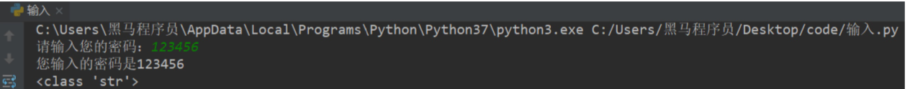

# <center>3 Python 基础语法

## 3.1 注释

- 单行注释
  ```python
  # 注释内容
  ```

- 多行注释
  ```
  """
    第一行注释
    第二行注释
    第三行注释
  """

  '''
    注释1
    注释2
    注释3
  '''
  ```
- 快捷键： ctrl + /

## 3.2 变量

### 3.2.1 认识变量

- 程序中，数据都是临时存储在内存中，为了更快速的查找或使用这个数据，通常我们把这个数据在内存中存储之后定义一个名称，这个名称就是变量
- 变量就是一个存储数据的的时候当前数据所在的内存地址的名字而已


### 3.2.2 定义变量

- 变量名自定义，要满足标识符命名规则
    ```python
    变量名 = 值
    ```

- 标识符命名规则是Python中定义各种名字的时候的统一规范，具体如下：
  - 由数字、字母、下划线组成
  - 不能数字开头
  - 不能使用内置关键字
  - 严格区分大小写


- 内置关键字
    ```python
    False     None    True   and      as       assert   break     class  
    continue  def     del    elif     else     except   finally   for
    from      global  if     import   in       is       lambda    nonlocal
    not       or      pass   raise    return   try      while     with  
    yield
    ```


- 命名习惯
  - 见名知义
  - 大驼峰：即每个单词首字母都大写，例如：`MyName`
  - 小驼峰：第二个（含）以后的单词首字母大写，例如：`myName`
  - 下划线：例如：`my_name`


### 3.2.3 使用变量

```python
my_name = 'TOM'
print(my_name)

schoolName = '江西理工大学'
print(schoolName)
```

## 3.3 数据类型

### 3.3.1 认识数据类型

- 在 Python 里为了应对不同的业务需求，也把数据分为不同的类型

      

- 检测数据类型的方法：`type()`
    ```python
    a = 1
    print(type(a))  # <class 'int'> -- 整型

    b = 1.1
    print(type(b))  # <class 'float'> -- 浮点型

    c = True
    print(type(c))  # <class 'bool'> -- 布尔型

    d = '12345'
    print(type(d))  # <class 'str'> -- 字符串

    e = [10, 20, 30]
    print(type(e))  # <class 'list'> -- 列表

    f = (10, 20, 30)
    print(type(f))  # <class 'tuple'> -- 元组

    h = {10, 20, 30}
    print(type(h))  # <class 'set'> -- 集合

    g = {'name': 'TOM', 'age': 20}
    print(type(g))  # <class 'dict'> -- 字典
    ```

### 3.3.2 数据类型转换

- 转换数据类型的函数

|          函数          |                        说明                         |
| :--------------------: | :-------------------------------------------------: |
|    int(x [,base ])     |                  将x转换为一个整数                  |
|       float(x)        |                 将x转换为一个浮点数                 |
| complex(real [,imag ]) |        创建一个复数，real为实部，imag为虚部         |
|        str(x)         |                将对象 x 转换为字符串                |
|        repr(x)        |             将对象 x 转换为表达式字符串             |
|       eval(str)       | 用来计算在字符串中的有效Python表达式,并返回一个对象 |
|       tuple(s)        |               将序列 s 转换为一个元组               |
|        list(s)        |               将序列 s 转换为一个列表               |
|        chr(x)         |           将一个整数转换为一个Unicode字符           |
|        ord(x)         |           将一个字符转换为它的ASCII整数值           |
|        hex(x)         |         将一个整数转换为一个十六进制字符串          |
|        oct(x)         |          将一个整数转换为一个八进制字符串           |
|        bin(x)         |          将一个整数转换为一个二进制字符串           |

``` python
# 1. float() -- 转换成浮点型
num1 = 1
print(float(num1))
print(type(float(num1)))

# 2. str() -- 转换成字符串类型
num2 = 10
print(type(str(num2)))

# 3. tuple() -- 将一个序列转换成元组
list1 = [10, 20, 30]
print(tuple(list1))
print(type(tuple(list1)))


# 4. list() -- 将一个序列转换成列表
t1 = (100, 200, 300)
print(list(t1))
print(type(list(t1)))

# 5. eval() -- 将字符串中的数据转换成Python表达式原本类型
str1 = '10'
str2 = '[1, 2, 3]'
str3 = '(1000, 2000, 3000)'
print(type(eval(str1)))
print(type(eval(str2)))
print(type(eval(str3)))
```

## 3.4 输入

- 输入的语法
    ```python
    input("提示信息")
    ```

- 输入的特点
  - 当程序执行到`input`，等待用户输入，输入完成之后才继续向下执行
  - 在Python中，`input`接收用户输入后，一般存储到变量，方便使用
  - 在Python中，`input`会把接收到的任意用户输入的数据都当做字符串处理


```python
password = input('请输入您的密码：')

print(f'您输入的密码是{password}')
# <class 'str'>
print(type(password))
```
控制台输出结果如下：



## 3.5 输出

### 3.5.1 格式化输出

- 所谓的格式化输出即按照一定的格式输出内容

| 格式符号 |          转换          |
| :------: | :--------------------: |
|  **%s**  |         字符串         |
|  **%d**  |   有符号的十进制整数   |
|  **%f**  |         浮点数         |
|    %c    |          字符          |
|    %u    |    无符号十进制整数    |
|    %o    |       八进制整数       |
|    %x    | 十六进制整数（小写ox） |
|    %X    | 十六进制整数（大写OX） |
|    %e    | 科学计数法（小写'e'）  |
|    %E    | 科学计数法（大写'E'）  |
|    %g    |      %f和%e的简写      |
|    %G    |      %f和%E的简写      |

- %06d，表示输出的整数显示位数，不足以0补全，超出当前位数则原样输出
- %.2f，表示小数点后显示的小数位数

### 3.5.2 f-字符串

- 格式化字符串除了%s，还可以写为`f'{表达式}'`

    ```python
    age = 18 
    name = 'TOM'
    weight = 75.5
    student_id = 1

    # 我的名字是TOM
    print('我的名字是%s' % name)

    # 我的学号是0001
    print('我的学号是%4d' % student_id)

    # 我的体重是75.50公斤
    print('我的体重是%.2f公斤' % weight)

    # 我的名字是TOM，今年18岁了
    print('我的名字是%s，今年%d岁了' % (name, age))

    # 我的名字是TOM，明年19岁了
    print('我的名字是%s，明年%d岁了' % (name, age + 1))

    # 我的名字是TOM，明年19岁了
    print(f'我的名字是{name}, 明年{age + 1}岁了')
    ```
- f-格式化字符串是Python3.6中新增的格式化方法，该方法更简单易读


### 3.5.3 转义字符

- `\n`：换行
- `\t`：制表符，一个tab键（4个空格）的距离

### 3.5.4 结束符

- 想一想，为什么两个print会换行输出？

    ```python
    print('输出的内容', end="\n")
    ```
- 在Python中，print()， 默认自带`end="\n"`这个换行结束符，所以导致每两个`print`直接会换行展示，用户可以按需求更改结束符

    ```python
    print('hello', end="\n")
    print('world', end="\t")

    # end结束符可以自定义
    print('hello', end="...")
    print('Python')
    ```

## 3.6 运算符

### 3.6.1 算数运算符

| 运算符 |  描述  |                         实例                          |
| :----: | :----: | :---------------------------------------------------: |
|   +    |   加   |                  1 + 1 输出结果为 2                   |
|   -    |   减   |                   1-1 输出结果为 0                    |
|   *    |   乘   |                  2 * 2 输出结果为 4                   |
|   /    |   除   |                  10 / 2 输出结果为 5                  |
|   //   |  整除  |                  9 // 4 输出结果为2                   |
|   %    |  取余  |                  9 % 4 输出结果为 1                   |
|   **   |  指数  |        2`**`4 输出结果为 16，即 2`*`2`*`2`*`2         |
|   ()   | 小括号 | 小括号用来提高运算优先级，即 (1 + 2) * 3 输出结果为 9 |

- 混合运算优先级顺序：`()`高于 `**` 高于 `*` `/` `//` `%` 高于 `+` `-`


### 3.6.2 赋值运算符

| 运算符 | 描述 |                实例                 |
| :----: | :--: | :---------------------------------: |
|   =    | 赋值 | 将`=`右侧的结果赋值给等号左侧的变量 |

- 单个变量赋值
    ```python
    num = 1
    print(num)
    ```


- 多个变量赋值
    ```python
    num1, float1, str1 = 10, 0.5, 'hello world'
    print(num1)
    print(float1)
    print(str1)
    ```


- 多变量赋相同值
    ```python
    a = b = 10
    print(a)
    print(b)
    ```

### 3.6.3 复合赋值运算符

| 运算符 |      描述      |            实例            |
| :----: | :------------: | :------------------------: |
|   +=   | 加法赋值运算符 |  c += a 等价于 c = c + a   |
|   -=   | 减法赋值运算符 |   c -= a 等价于 c = c- a   |
|   *=   | 乘法赋值运算符 |  c *= a 等价于 c = c * a   |
|   /=   | 除法赋值运算符 |  c /= a 等价于 c = c / a   |
|  //=   | 整除赋值运算符 | c //= a 等价于 c = c // a  |
|   %=   | 取余赋值运算符 |  c %= a 等价于 c = c % a   |
|  **=   |  幂赋值运算符  | c ** = a 等价于 c = c ** a |

```python
a = 100
a += 1
# 输出101  a = a + 1,最终a = 100 + 1
print(a)

b = 2
b *= 3
# 输出6  b = b * 3,最终b = 2 * 3
print(b)

c = 10
c += 1 + 2
# 输出13, 先算运算符右侧1 + 2 = 3， c += 3 , 推导出c = 10 + 3
print(c)
```

### 3.6.4 比较运算符

- 比较运算符也叫关系运算符， 通常用来判断

| 运算符 |                                       描述                                        |                            实例                             |
| :----: | :-------------------------------------------------------------------------------: | :---------------------------------------------------------: |
|   ==   | 判断相等。如果两个操作数的结果相等，则条件结果为真(True)，否则条件结果为假(False) |               如a=3,b=3，则（a == b) 为 True                |
|   !=   |  不等于 。如果两个操作数的结果不相等，则条件为真(True)，否则条件结果为假(False)   | 如a=3,b=3，则（a == b) 为 True如a=1,b=3，则(a != b) 为 True |
|   >    |    运算符左侧操作数结果是否大于右侧操作数结果，如果大于，则条件为真，否则为假     |                如a=7,b=3，则(a > b) 为 True                 |
|   <    |    运算符左侧操作数结果是否小于右侧操作数结果，如果小于，则条件为真，否则为假     |                如a=7,b=3，则(a < b) 为 False                |
|   >=   |  运算符左侧操作数结果是否大于等于右侧操作数结果，如果大于，则条件为真，否则为假   | 如a=7,b=3，则(a < b) 为 False如a=3,b=3，则(a >= b) 为 True  |
|   <=   |  运算符左侧操作数结果是否小于等于右侧操作数结果，如果小于，则条件为真，否则为假   |                如a=3,b=3，则(a <= b) 为 True                |

```python
a = 7
b = 5
print(a == b)  # False
print(a != b)  # True
print(a < b)   # False
print(a > b)   # True
print(a <= b)  # False
print(a >= b)  # True
```

### 3.6.5 逻辑运算符

| 运算符 | 逻辑表达式 |                                 描述                                  |                   实例                   |
| :----: | :--------: | :-------------------------------------------------------------------: | :--------------------------------------: |
|  and   |  x and y   |  布尔"与"：如果 x 为 False，x and y 返回 False，否则它返回 y 的值。   |      True and False， 返回 False。       |
|   or   |   x or y   |      布尔"或"：如果 x 是 True，它返回 True，否则它返回 y 的值。       |       False or True， 返回 True。        |
|  not   |   not x    | 布尔"非"：如果 x 为 True，返回 False 。如果 x 为 False，它返回 True。 | not True 返回 False, not False 返回 True |


- 表达式的逻辑运算
    ```python
    a = 1
    b = 2
    c = 3
    print((a < b) and (b < c))  # True
    print((a > b) and (b < c))  # False
    print((a > b) or (b < c))   # True
    print(not (a > b))          # True
    ```


- 数字之间的逻辑运算
    ```python
    a = 0
    b = 1
    c = 2

    # and运算符，只要有一个值为0，则结果为0，否则结果为最后一个非0数字
    print(a and b)  # 0
    print(b and a)  # 0
    print(a and c)  # 0
    print(c and a)  # 0
    print(b and c)  # 2
    print(c and b)  # 1

    # or运算符，只有所有值为0结果才为0，否则结果为第一个非0数字
    print(a or b)  # 1
    print(a or c)  # 2
    print(b or c)  # 1
    ```

### 3.6.6 三目运算符

- 语法：条件成立执行的表达式 if 条件 else 条件不成立执行的表达式
    ```python
    a = 1
    b = 2

    c = a if a > b else b
    print(c) # 2

    # 需求： 有两个变量，比较大小 如果变量1 大于 变量2 执行 变量 1 - 变量2； 否则 变量2 - 变量1
    aa = 10
    bb = 6
    cc = aa - bb if aa > bb else bb - aa
    print(cc) # 4
    ```